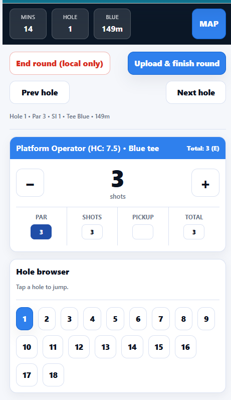

# 18Birds

18Birds is a multi-tenant golf scoring and administration platform built to support clubs, competitions, operational workflows, and scalable SaaS delivery.

## Purpose of this repository
This is a public portfolio repository created for technical review. It provides a high-level view of the product, architecture, engineering decisions, and selected implementation samples without exposing private production details.

## My role
Founder, Product Lead, Engineering Lead

## What I owned
- Product direction and solution design
- Frontend engineering and UX iteration
- Authentication and authorization approach
- Multi-tenant architecture decisions
- Supabase data model and access patterns
- CI/CD and deployment workflow
- AI-assisted engineering workflows for delivery acceleration

## Stack
- React
- TypeScript
- Vite
- Supabase
- Vercel
- GitHub

## Key engineering themes
- Multi-tenant SaaS architecture
- Secure auth and tenant isolation
- Structured frontend architecture
- CI/CD and deployment discipline
- AI-assisted development and review workflows

## Repository contents
- `docs/architecture-overview.md` — system overview and design decisions
- `docs/product-summary.md` — product summary and business context
- `images/` — screenshots and diagrams
- `samples/` — selected representative code samples

## Screenshots
##Admin Dashboard
### Login

### Dashboard

### Golf Scoring App example

## Notes
This repository is intentionally sanitized. It does not include private credentials, customer data, production secrets, or the full private codebase.
