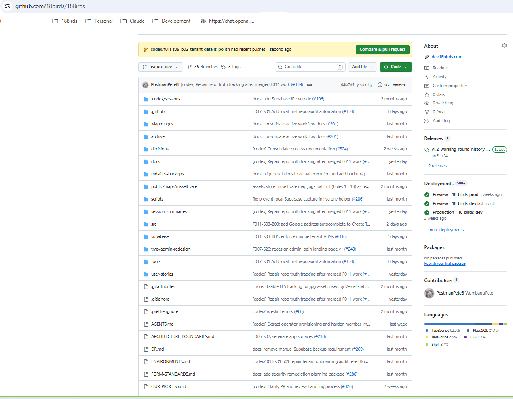
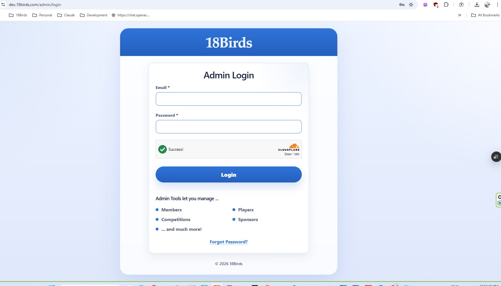
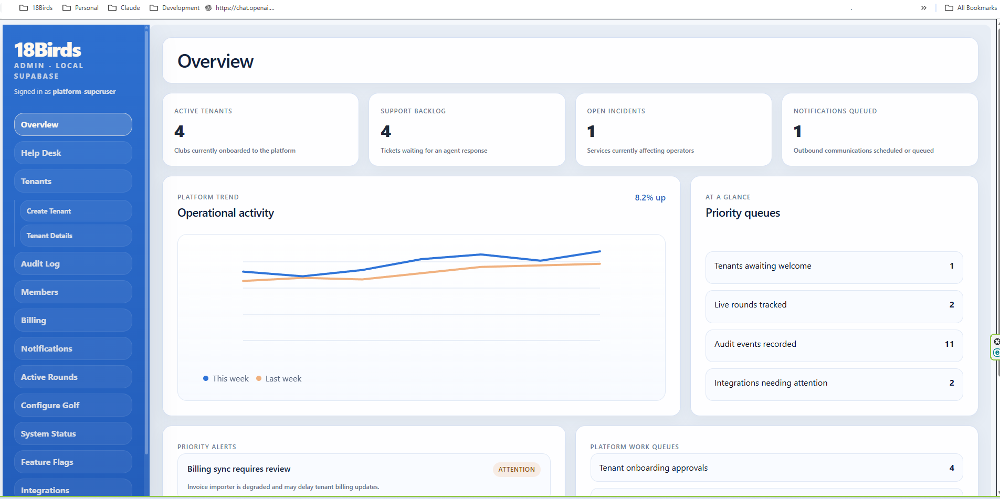
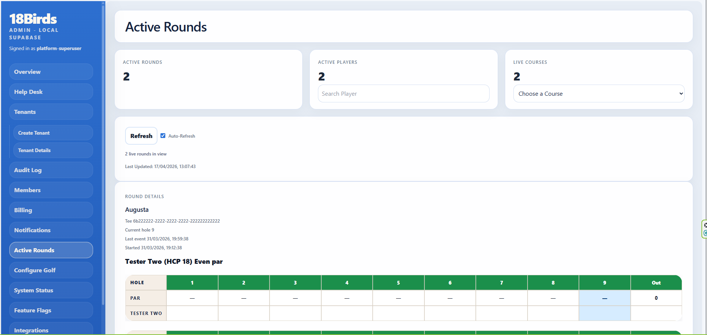
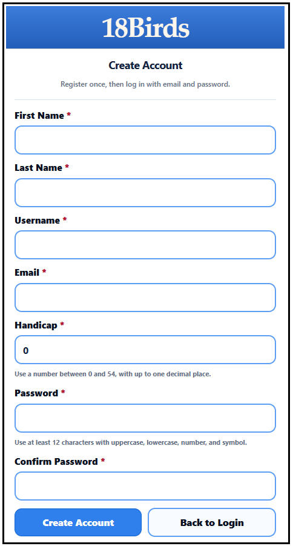
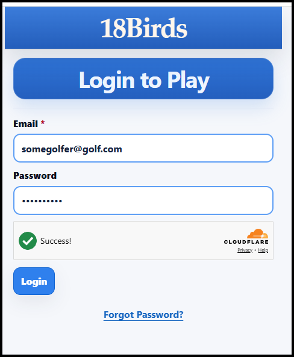
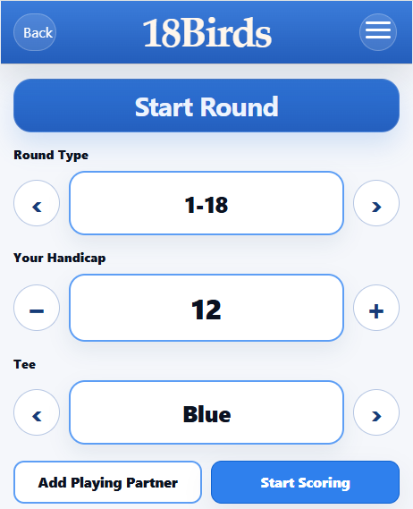
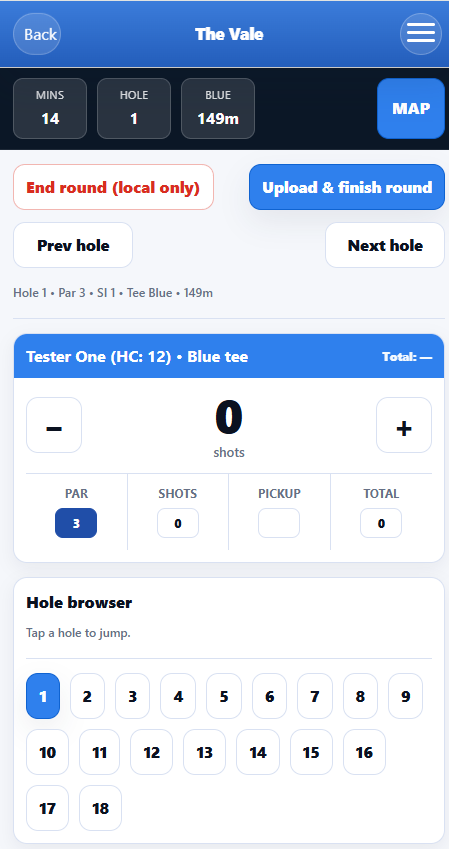

# 18Birds

18Birds is a multi-tenant golf scoring and administration platform designed to support clubs, competitions, operational workflows, and scalable SaaS delivery.

The Golf Scoring Application currently supports:
- 
- Full create account workflow
- Google Places / Address Validation style address autocomplete integration for tenant/admin address entry
- Cloudflare Turnstile checks on all login/auth forms
- Round type, handicap and tee box decision making
- Playing partner supported
- Live score recording and total score calculation
- Amount of time round is taking
- Map of each hole
- Uploading of round
- Ability to view historical rounds

Live rounds are then also able to be tracked by the club administrator from the admin dashboard that each club/tenant is provided with.

The Administrator Dashboard currently supports:
- 
- Platform Superuser and multi-tenant admin dashboards
- Tenant onboarding workflow
- Initial tenant admin setup
- Initial course setup - multiple courses per tenant supported
- Initial membership upload
- Audit log
- Active rounds including pace of play configuration

It has been built using a local AI-assisted development setup using OpenAI Codex CLI in Ubuntu (WSL) within VS Code, supporting React/TypeScript, Supabase, GitHub, and Vercel-based SaaS delivery. 

I have included a number of my process files in the docs folder - this will give you a feeling for the type of process I have evolved over time. Pairing this type of approach with deliberately small slice PR's has proven to be a good way to control the output and avoid hallucinations etc. 

Process Docs
-
- my current start of session prompt
- AGENTS.md

## Purpose of this repository
This is a public portfolio repository prepared for technical review. It provides a high-level view of the product, architecture, engineering decisions, user experience, and selected implementation samples without exposing private production details.

The working repo at https://github.com/18birds/18Birds is private and I am happy to walk you through the repo one on one if you would like. I have attached a screenshot of the home page and it shows:
- Releases 3
- Deployments 500+
- Most of the .md files I use in the workflow - AGENTS.md is the orchestrator but there are a number of others dealing with workflow, security, architecture, patterns etc

## My role
Founder, Product Lead, Engineering Lead

My role in the development process is to act as the technical product and delivery coordinator: translating business needs into clear requirements, designing the solution approach, directing AI-assisted engineering workflows, reviewing implementation outputs, and maintaining alignment across architecture, security, and delivery quality.

I have deliberately evolved the development process so that it is not just fast, but controlled. That has meant introducing stronger security thinking, auditability, and delivery guardrails, with clearer review points, validation steps, traceable decisions, and practical controls to reduce risk while maintaining speed and flexibility.

## What I owned
- Product direction and solution design
- Frontend architecture and UX iteration
- Authentication and authorization approach
- Multi-tenant architecture decisions
- Supabase data model and access patterns
- CI/CD and deployment workflow
- AI-assisted engineering workflows for delivery acceleration

## Stack
- React
- TypeScript
- Vite
- Supabase
- Vercel
- GitHub

## Key engineering themes
- Multi-tenant SaaS architecture
- Secure authentication and tenant isolation
- Structured frontend design
- Delivery discipline through CI/CD
- Practical AI-assisted development and review workflows

## Repository contents
- `docs/architecture-overview.md` — system overview and design decisions
- `docs/product-summary.md` — product summary and business context
- `images/` — screenshots and visual references
- `samples/` — selected representative code samples

## Screenshots

### Active 18Birds Repo

### Admin Login

### Admin Dashboard

### Active Rounds

### Golf Scoring App - create account screen

### Golf Scoring App - login screen

### Golf Scoring App - pre-round setup

### Golf Scoring App - live scoring

## Notes
This repository is intentionally sanitized. It does not include private credentials, customer data, production secrets, or the complete private production codebase.
