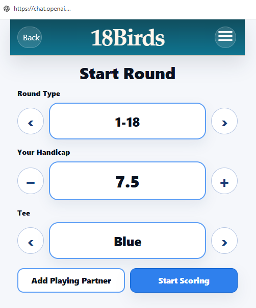

# 18Birds

18Birds is a multi-tenant golf scoring and administration platform designed to support clubs, competitions, operational workflows, and scalable SaaS delivery.

## Purpose of this repository
This is a public portfolio repository prepared for technical review. It provides a high-level view of the product, architecture, engineering decisions, user experience, and selected implementation samples without exposing private production details.

## My role
Founder, Product Lead, Engineering Lead

## What I owned
- Product direction and solution design
- Frontend architecture and UX iteration
- Authentication and authorization approach
- Multi-tenant architecture decisions
- Supabase data model and access patterns
- CI/CD and deployment workflow
- AI-assisted engineering workflows for delivery acceleration

## Stack
- React
- TypeScript
- Vite
- Supabase
- Vercel
- GitHub

## Key engineering themes
- Multi-tenant SaaS architecture
- Secure authentication and tenant isolation
- Structured frontend design
- Delivery discipline through CI/CD
- Practical AI-assisted development and review workflows

## Repository contents
- `docs/architecture-overview.md` — system overview and design decisions
- `docs/product-summary.md` — product summary and business context
- `images/` — screenshots and visual references
- `samples/` — selected representative code samples

## Screenshots

### Admin Login

### Admin Dashboard

### Active Rounds

### Golf Scoring App

## Notes
This repository is intentionally sanitized. It does not include private credentials, customer data, production secrets, or the complete private production codebase.
